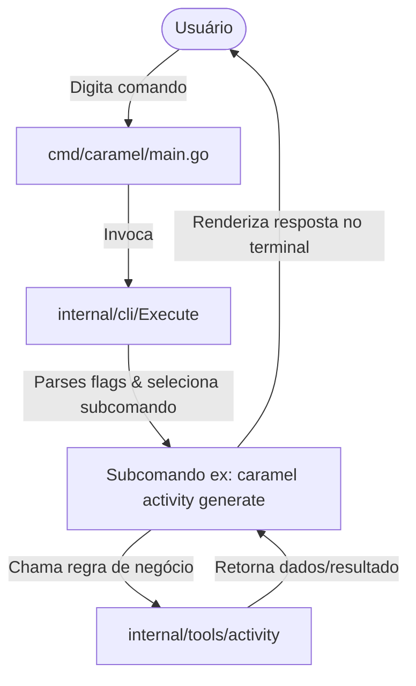

# 🏛️ Arquitetura do Caramel CLI

O **Caramel CLI** é uma aplicação em Go projetada para fornecer um ecossistema de ferramentas de linha de comando voltadas para o desenvolvimento pedagógico e utilitários do dia a dia.

---

## 📁 Estrutura de Diretórios

```text
Caramel/
├── cmd/
│   └── caramel/             # Ponto de entrada (main.go)
├── docs/                    # Documentação técnica e Guias do sistema
│   ├── ARCHITECTURE.md      # Visão geral da arquitetura (este arquivo)
│   ├── GETTING_STARTED.md   # Guia de início rápido e compilação
│   └── CONTRIBUTING_COMMANDS.md # Como criar novos comandos e ferramentas
├── internal/                # Regras de negócio e código privado
│   ├── cli/                 # Comandos e subcomandos CLI (Cobra)
│   │   ├── root.go          # Comando raiz (`caramel`)
│   │   └── version.go       # Comando de versão (`caramel version`)
│   ├── config/              # Gerenciador de configurações e preferências
│   └── tools/               # Módulos e motores das ferramentas pedagógicas
│       ├── activity/        # Geradores de atividades, exercícios e gabaritos
│       └── dev/             # Ferramentas para desenvolvedores pedagógicos
├── dist/                    # Binários gerados pela compilação (ignorado no git)
├── scripts/                 # Scripts automatizados
│   ├── build.sh             # Compilação cross-platform (Linux & Windows)
│   ├── install.sh           # Instalador automático para Linux
│   └── install.ps1          # Instalador automático para Windows (PowerShell)
├── go.mod                   # Gerenciador de módulos Go
├── go.sum
└── README.md
```

---

## 🧩 Componentes Principais

### 1. Entrypoint (`cmd/caramel/main.go`)
Contém apenas a chamada para `cli.Execute()`. A lógica de roteamento fica encapsulada no pacote `internal/cli`.

### 2. Pacote de CLI (`internal/cli/`)
Construído utilizando o framework **Cobra** (`github.com/spf13/cobra`).
- Cada novo subcomando deve residir nesta pasta ou em subpastas organizadas por domínio.
- Os comandos registram-se no `RootCmd` através da função `init()`.

### 3. Pacote de Ferramentas (`internal/tools/`)
Isola toda a lógica de negócio das ferramentas da CLI:
- Não deve conter código direto de CLI (como prints de flags ou parsing de argumentos de terminal).
- Retorna dados puros, estruturas Go ou erros formatados para o pacote `cli`.

---

## 🔄 Fluxo de Execução



---

## 📦 Compilação Cross-Platform (Linux & Windows)

O Caramel utiliza a compilação nativa do Go sem dependências C (`CGO_ENABLED=0`).

Os binários produzidos são:
- `caramel-linux-amd64` (Linux 64-bit)
- `caramel-linux-arm64` (Linux ARM 64-bit)
- `caramel-windows-amd64.exe` (Windows 64-bit)
